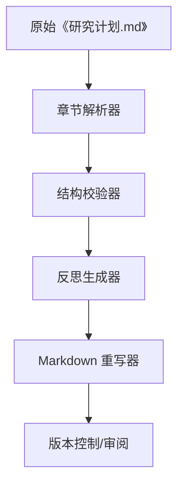

## Product Overview

为《研究计划.md》添加统一的苏格拉底反思结构，让每章在核心内容后都有“Why it succeeded”和“Valuable failed attempts”小节，强化研究叙事的连贯性与可读性。

## Core Features

- 章节解析：识别并规范各章标题、子标题与现有反思内容。
- 成功驱动总结：每章提炼关键成功因素并以结构化要点呈现。
- 失败经验沉淀：记录各章未奏效尝试、触发条件及后续调整。
- 风格一致性：统一段落命名、语气、编号与引用方式，确保全篇视觉和语义连贯。

## Tech Stack

- 脚本语言：Node.js + TypeScript
- Markdown 处理：remark/gray-matter 工具链
- 校验：自定义 lint 规则 + Markdownlint

## 技术架构

- 分层模式：解析层 → 逻辑层 → 输出层。
- 解析层读取 Markdown，逻辑层生成/更新反思段落，输出层写回文件并记录差异。



## 模块划分

- **章节解析器**：负责标题、序号与内容块识别；依赖 remark。
- **结构校验器**：判断章节是否缺失反思小节并返回差异；依赖解析器输出。
- **反思生成器**：根据模板拼装“成功驱动/宝贵失败”；调用领域数据源。
- **Markdown 重写器**：将新增段落插入原文并维持格式；对接 Git 流程。

## 数据流

用户提供的章节文本 → 解析器生成 AST → 校验器判定缺口 → 反思生成器输出模板化段落 → 重写器合并 → Markdownlint 校验 → 交付。

## 实施细节

### 目录结构（新增/修改部分）

```
tech_blog/
└── scripts/
    ├── reflection/
    │   ├── parser.ts
    │   ├── generator.ts
    │   ├── validator.ts
    │   └── updater.ts
    └── cli.ts
```

### 核心结构示例

```typescript
interface ChapterReflection {
  title: string;
  successDrivers: string[];
  valuableFailures: { attempt: string; insight: string }[];
}

function ensureReflection(chapter: ChapterNode): ChapterReflection { /* ... */ }
```

## 技术实施计划

1. **章节结构盘点**  

- 解析 Markdown AST，输出章节与现有反思映射。  
- 测试：比对章节数量与期望章节表。

2. **模板与规则定义**  

- 设计“why it succeeded / valuable failed attempts”子标题、要点格式。  
- 测试：示例章渲染结果符合模板。

3. **自动补全逻辑**  

- 对缺失部分注入模板化段落，占位符等待人工填充或自动生成。  
- 测试：执行 dry-run，确保 diff 只影响目标区域。

4. **内容扩写与校对**  

- 引用现有数据填充成功驱动，整理失败案例。  
- 测试：人工审阅 + Markdownlint。

5. **输出与版本管理**  

- 写回《研究计划.md》，生成修改摘要。  
- 测试：Git diff 复核 + 终端预览。

## 性能与质量

- 使用增量更新，避免整文件重写导致冲突。
- 通过 Markdownlint 和自定义校验器保证命名、列表与标题层级一致。
- 版本控制中保留原始反思作为参考，便于回滚与审计。

## 安全与可扩展

- 本地操作文件，无敏感数据外发。
- 模块化脚本便于未来扩展至其他文档或新增反思类型。

# Agent Extensions

- **code-explorer**
- Purpose: 读取与梳理《研究计划.md》现有章节及反思内容
- Expected outcome: 获得精确的章节列表、缺失反思位置及上下文，支撑后续撰写