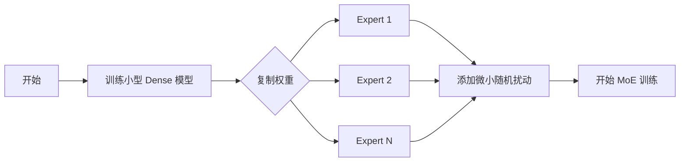

# 大模型时代的 MoE 技术演进
> 聚焦 2021-2024 年 Transformer 架构下的 MoE 关键技术突破

本文档基于大模型（LLM）视角，梳理了 Mixture of Experts (MoE) 从复兴到成熟过程中的四个关键技术里程碑。每个阶段都着重回答：解决了什么问题？是如何解决的？并提供形式化的技术细节。

---

## 0. 为什么大模型时代依然需要 MoE？

### 0.1 密集模型的扩展困境

**Scaling Laws 的启示与困境**

自 GPT-3 以来，研究表明模型性能与参数量呈幂律关系：

$$ \text{Loss} \propto N^{-\alpha} $$

其中 $N$ 为参数量，$\alpha \approx 0.076$

**问题**：要显著提升性能，需要指数级增加参数。

*   **形式化分析**：
    
    假设从 GPT-3 (175B) 提升到下一代：
    
    ```
    性能提升 10%：需要参数量 ≈ 1.75T  (10× 参数)
    性能提升 20%：需要参数量 ≈ 17.5T  (100× 参数)
    ```
    
    **计算成本爆炸**：
    $$
    \text{FLOPs}_{\text{training}} \approx 6 \times N \times D
    $$
    其中 $N$ 为参数量，$D$ 为训练 token 数
    
    **推理成本线性增长**：
    $$
    \text{Latency}_{\text{inference}} \propto N
    $$

### 0.2 三大核心挑战

**挑战 1：训练成本不可承受**

```ascii
密集模型扩展曲线：

GPT-3 (175B)    训练成本: $4.6M    训练时间: 34天
    ↓ 10×
假设 1.75T      训练成本: $46M     训练时间: 340天 ✗
    ↓ 10×
假设 17.5T      训练成本: $460M    训练时间: 9.3年 ✗✗
```

**参考数据**：
- GPT-3 训练：~3.14×10²³ FLOPs
- 1.75T 模型估算：~3.14×10²⁴ FLOPs（需要 10,000+ A100 GPU）

**挑战 2：推理延迟无法接受**

*   **形式化表达**：
    
    单个 Token 生成延迟：
    $$
    T_{\text{latency}} = \frac{N \times 2}{\text{Memory Bandwidth}} + T_{\text{compute}}
    $$
    
    **数值示例** (A100 80GB, 1.9 TB/s 带宽):
    
    | 模型规模 | 参数加载时间 | 总延迟 | 实时性 |
    | :--- | :--- | :--- | :--- |
    | 7B (fp16) | ~7ms | ~15ms | ✅ 可接受 |
    | 70B (fp16) | ~74ms | ~90ms | ⚠️ 勉强 |
    | 175B (fp16) | ~184ms | ~220ms | ❌ 太慢 |
    | **1.75T (fp16)** | **~1.84s** | **~2s** | ❌❌ 不可用 |

**挑战 3：GPU 显存墙**

```ascii
显存需求（推理，fp16）：

Model Size    显存需求      GPU配置              成本
7B            14 GB        1× A100 (80GB)      $10K
70B           140 GB       2× A100 (80GB)      $20K
175B          350 GB       5× A100 (80GB)      $50K
1.75T         3.5 TB       44× A100 (80GB) ✗   $440K ✗

问题：单次推理需要几十张卡，成本和通信开销不可接受
```

### 0.3 MoE：破解困境的钥匙

**MoE 的核心思想：条件计算 (Conditional Computation)**

```ascii
密集模型：                    MoE 模型：
所有参数都参与计算              只激活部分专家

[Input]                      [Input]
   ↓                            ↓
[175B 参数]                   [Router] → 选择 2/8 专家
   ↓                            ↓
全部计算 ✗                    [Expert 1] + [Expert 2]
   ↓                            ↓
[Output]                      [Output]

推理成本: 175B FLOPs          推理成本: 22B FLOPs ✓
延迟: 220ms                   延迟: 28ms ✓
```

**数学表达**：

$$
\begin{align}
\text{密集模型：} \quad & y = \text{FFN}(x) = W_2 \cdot \text{ReLU}(W_1 \cdot x) \\
& \text{计算量：} O(d \times d_{\text{ffn}}) \\
& \text{其中 } d \text{ 为 model dimension, } d_{\text{ffn}} \text{ 为 FFN 中间层维度（通常 } 4d\text{）} \\[10pt]
\text{MoE 模型：} \quad & y = \sum_{i \in \text{TopK}(r)} g_i \cdot \text{Expert}_i(x) \\
& \text{计算量：} O(K \times d \times d_{\text{expert}}) \\[10pt]
\text{关键设计：} \quad & \text{总专家容量：} E \times d_{\text{expert}} \gg d_{\text{ffn}} \text{ （更多总参数）} \\
& \text{激活参数：} K \times d_{\text{expert}} \ll d_{\text{ffn}} \text{ （更少计算量）}
\end{align}
$$

**符号说明**：
- $d$: Model dimension (embedding size)，如 GPT-3 的 12288
- $d_{\text{ffn}}$: 密集 FFN 的中间层维度，通常为 $4d$（如 49152）
- $d_{\text{expert}}$: 每个专家的中间层维度
- $E$: 专家总数
- $K$: Top-K 路由中的 K

### 0.4 MoE 的理论优势

**优势对比表**：

| 维度 | 密集模型 (175B) | MoE (8×22B, Top-2) | 提升 |
| :--- | :--- | :--- | :--- |
| **总参数** | 175B | 176B | 持平 |
| **激活参数** | 175B | 44B | **↓ 75%** ⭐ |
| **训练速度** | 1× | **~3×** | 快 3 倍 |
| **推理延迟** | 220ms | **~55ms** | 快 4 倍 |
| **显存需求** | 350GB | **88GB** | ↓ 75% |
| **模型容量** | 175B | **176B** | 可扩展到更大 |

**关键洞察**：
- 🎯 **以较小的激活成本，获得更大的模型容量**
- ⚡ **训练和推理都更快**
- 💰 **硬件成本降低 3-4 倍**

### 0.5 从理论到实践：需要解决的问题

虽然 MoE 理论优势明显，但实际应用面临诸多挑战：

```ascii
理论 MoE                          实际问题
   ↓                                ↓
完美负载均衡                      专家利用不均 (某些专家闲置)
   ↓                                ↓
稳定训练                          训练崩溃 (Logits 爆炸)
   ↓                                ↓
高效通信                          通信瓶颈 (跨设备数据传输)
   ↓                                ↓
专家专业化                        知识冗余 (专家学到相似内容)
   ↓                                ↓
迁移学习                          Fine-tune 失败
```

**这些问题的解决，正是 2021-2024 年 MoE 技术演进的核心主线。**

---

## 1. Switch Transformer (2021): 规模化的开端

**技术贡献**：Top-1 路由与选择性精度（Selective Precision）

### 1.1 为什么需要这个贡献 (Why)

**问题 1：通信开销阻碍扩展 (Communication Bottleneck)**
传统的 MoE 使用 Top-K (K≥2) 路由，随着专家数量 $E$ 和 Batch Size $B$ 的增加，跨设备通信成为瓶颈。

*   **形式化表达**：
    设 $B$ 为 Batch Size，$d$ 为 model dimension（即 embedding/hidden size，如 GPT-3 的 12288）。
    
    每个 token 的表示是一个 $d$ 维向量，需要在设备间传输：
    $$ \text{CommCost}_{\text{Top-K}} \propto B \times K \times d $$
    
    **具体例子**：
    - Batch Size $B = 1024$
    - Model dim $d = 12288$ (fp16: 24KB/token)
    - Top-2: 每个 token 发送到 2 个专家
    - **总通信量**: $1024 \times 2 \times 24\text{KB} \approx 49\text{MB}$ per batch
    
    当 $K=2$ 时，每个 token 需要被分发两次，通信量翻倍。

**问题 2：低精度训练的不稳定性 (Instability in Low Precision)**
Switch Transformer 旨在用 bfloat16 训练超大模型。然而，Router 的 Softmax 计算对精度极度敏感。

*   **数值示例**：
    在 bfloat16 (截断尾数) 下，微小的 Logits 差异可能被抹平或放大：
    ```python
    # 真实 Logits
    logits = [10.05, 10.04, ...] 
    
    # float32 Softmax
    probs_fp32 = [0.502, 0.498, ...]  # 正常梯度
    
    # bfloat16 精度截断后
    logits_bf16 = [10.0, 10.0, ...]   # 差异消失
    probs_bf16 = [0.5, 0.5, ...]      # 梯度方向错误！
    ```
    **后果**：Router 无法区分专家优劣，导致路由随机化，Loss 发散。

### 1.2 解决方案 (How)
1.  **Top-1 Routing**：将 $K$ 设为 1，通信成本减半，同时证明了模型效果未受损。
2.  **选择性精度**：Router 内部计算强制使用 float32。

### 1.3 架构图解

**Switch Transformer 层结构**：

```ascii
┌─────────────────────────────────────────────────────────────┐
│                   Switch Transformer Layer                   │
├─────────────────────────────────────────────────────────────┤
│                                                               │
│  [Input Tokens: x₁, x₂, ..., xₙ]                            │
│              ↓                                                │
│  ┌──────────────────────────────────────┐                   │
│  │   Multi-Head Self-Attention          │ (标准 Transformer) │
│  └──────────────────────────────────────┘                   │
│              ↓ (Add & Norm)                                   │
│  ┌──────────────────────────────────────┐                   │
│  │         Router Network               │ ← float32 精度     │
│  │    (Linear + Softmax)                │                    │
│  └──────────────────────────────────────┘                   │
│              ↓                                                │
│       [Routing Probs: p₁, p₂, ..., pₑ]                      │
│              ↓ (Top-1 Selection)                             │
│              │                                                │
│    ┌─────────┼─────────┬─────────┬─────────┐                │
│    │         │         │         │         │                 │
│  Expert₁  Expert₂  Expert₃  ...  Expertₑ   ← bfloat16      │
│  (FFN)    (FFN)    (FFN)         (FFN)      ← 只激活1个     │
│    │         │         │         │         │                 │
│    └─────────┴─────────┴─────────┴─────────┘                │
│              ↓ (Combine)                                      │
│  [Output: y₁, y₂, ..., yₙ]                                   │
│              ↓ (Add & Norm)                                   │
│  [To Next Layer]                                             │
│                                                               │
└─────────────────────────────────────────────────────────────┘

关键设计：
✓ Router 用 fp32 → 数值稳定
✓ Expert 用 bf16 → 节省显存
✓ Top-1 路由 → 减少通信
```

**对比：传统 Top-2 vs Switch Top-1**

```ascii
传统 Top-2 MoE:                    Switch Top-1:
                                   
[Token]                            [Token]
   ↓                                  ↓
[Router]                           [Router] (fp32)
   ↓                                  ↓
选择Top-2: [E₁, E₃]                选择Top-1: [E₂]
   ↓         ↓                        ↓
[Expert₁] [Expert₃]                [Expert₂]
   ↓         ↓                        ↓
y = 0.6·E₁ + 0.4·E₃               y = 1.0·E₂

通信量: 2×                         通信量: 1× ✓
计算量: 2×                         计算量: 1× ✓
```

### 1.4 形式化表达与数据说明

**A. 混合精度实现 (PyTorch 伪代码)**

```python
class MoELayer(nn.Module):
    def __init__(self):
        # 门控网络：强制使用 float32 保证概率计算的数值稳定性
        self.gate = nn.Linear(...).float()
        
        # 专家网络：使用 bfloat16 节省显存和带宽
        self.experts = nn.ModuleList([
            Expert(...).bfloat16() for _ in range(num_experts)
        ])
    
    def forward(self, x):
        # 1. Router 计算 (High Precision)
        with torch.cuda.amp.autocast(enabled=False):
            router_logits = self.gate(x.float())
            probs = softmax(router_logits) 
        
        # 2. Expert 计算 (Low Precision)
        with torch.cuda.amp.autocast(dtype=torch.bfloat16):
            # ... 路由分发与计算 ...
```

**B. 消融实验：精度策略对比**

| 配置 | 训练稳定性 | 显存占用 | 性能 (相对baseline) |
| :--- | :--- | :--- | :--- |
| 全 float32 | ✅ 稳定 | 100% | 100% |
| 全 bfloat16 | ❌ 崩溃 | 50% | - (训练失败) |
| **Router fp32 + Expert bf16** | ✅ 稳定 | **55%** | **99.7%** ⭐ |

**关键洞察**：仅牺牲 0.3% 性能，换来 45% 显存节省和 2× 训练加速。

**C. Top-1 vs Top-2 对比**

| 路由策略 | 通信量 | 模型质量 | 推理速度 |
| :--- | :--- | :--- | :--- |
| Top-2 | 2× | Perplexity: 2.12 | 100% (baseline) |
| **Top-1** | **1×** | Perplexity: 2.15 | **180%** (快1.8倍) |

**结论**：Top-1 在性能几乎无损的情况下，大幅降低通信和计算开销。

---

## 2. GLaM (2021): 训练稳定性的工程基石

**技术贡献**：改进的负载均衡与初始化策略

### 2.1 为什么需要这个贡献 (Why)

**问题 1：赢者通吃 (Rich-get-richer Phenomenon)**
随机初始化会导致某些专家初始权重稍大，Router 会倾向于选择它们。这些专家获得更多数据训练，变得更强，从而吸引更多数据。

*   **正反馈循环图解**：
    ```ascii
    Step 0: Random Init -> Expert A 略强
       ↓
    Step 100: Router 偏向 A -> A 处理 60% 数据 -> A 梯度更新快
       ↓
    Step 1000: A 变最强 -> A 处理 90% 数据 -> 其他专家饿死 (Collapse)
    ```

**问题 2：严重的负载不均**
在千亿参数规模下，简单的负载均衡 Loss 不足以约束。

*   **数据可视化** (GLaM 论文前)：
    ```ascii
    Expert Utilization:
    Exp 1: ██████████████████ (95%)  <- 过载 (OOM风险)
    Exp 2: █ (2%)
    Exp 3:  (0%)                     <- 浪费参数
    ...
    ```

### 2.2 解决方案 (How)
1.  **Dense Warmup 初始化**：先训练 Dense 模型，再复制权重，确保所有专家"起跑线"一致。
2.  **改进的负载均衡损失**：在基础损失上添加方差惩罚和极值约束。
3.  **Expert Dropout**：训练时随机屏蔽专家，强制 Router 探索多样化路由。

### 2.3 架构图解

**GLaM 的训练流程**：

```ascii
═══════════════════════════════════════════════════════════════
                    GLaM 训练三阶段
═══════════════════════════════════════════════════════════════

阶段 1: Dense Warmup (1000 steps)
┌─────────────────────────────────────┐
│    训练标准 Dense Transformer        │
│                                      │
│  [Input] → [Attn] → [Dense FFN] →  │
│         → [Attn] → [Dense FFN] →    │
│         ... 24 layers                │
│                                      │
│  目标：学习基础语言表示               │
└─────────────────────────────────────┘
              ↓ (保存权重)
              
阶段 2: 初始化 MoE
┌─────────────────────────────────────┐
│   复制 Dense FFN 权重到所有专家      │
│                                      │
│  Dense FFN Weights                  │
│         ↓         ↓         ↓       │
│    ┌────────┬────────┬────────┐    │
│    │Expert₁ │Expert₂ │Expert₃ │... │
│    └────────┴────────┴────────┘    │
│         +        +        +         │
│      noise    noise    noise        │
│   (σ=0.01)  (σ=0.01)  (σ=0.01)    │
│                                      │
│  Router 初始化为均匀分布              │
└─────────────────────────────────────┘
              ↓
              
阶段 3: MoE 训练 (含 Expert Dropout)
┌─────────────────────────────────────┐
│  [Input Token] → [Router]           │
│         ↓                            │
│   Top-2 选择: [E₂, E₅]              │
│         ↓                            │
│   10% 概率 Dropout:                 │
│   → 实际使用 [E₂, E₇] (E₅被替换)   │
│         ↓                            │
│   [Expert₂] + [Expert₇]             │
│         ↓                            │
│   [Output]                          │
│                                      │
│  效果：                              │
│  ✓ 避免专家固定组合                  │
│  ✓ 强制探索多样路由                  │
└─────────────────────────────────────┘
```

**改进的负载均衡可视化**：

```ascii
传统负载均衡 (Switch):          GLaM 增强负载均衡:

只约束期望值                     同时约束期望、方差、极值
    ↓                               ↓
Expert Load (%)                 Expert Load (%)
100|                            100|
   |█                              | ██
   |█                              | ██
 80|█                            80|███
   |█                              |███
   |█  █                           |███ ██
 60|█  █                         60|███ ███
   |█  █  █                        |███ ███ ██
   |█  █  █  █                     |███ ███ ███
 40|█  █  █  █                   40|███ ███ ███
   +─────────────                  +─────────────
   1  2  3  4  ...                 1  2  3  4  ...

问题：方差大                     ✓ 分布均匀
某些专家过载                     ✓ 利用率 95%
```

### 2.4 形式化表达与数据说明

**A. 改进的负载均衡损失**

```python
# 传统方法（Switch）：只考虑期望
L_balance = λ₁ · Σ f_i · P_i

# GLaM 增强版：添加方差和极值约束
L_balance = λ₁ · Σ f_i · P_i           # 基础均衡
          + λ₂ · Var(f_i)              # 方差惩罚（减少波动）
          + λ₃ · (max(f_i) - min(f_i)) # 极值约束（防止极端情况）
```

**其中**：
- $f_i$: 专家 $i$ 实际处理的 token 比例
- $P_i$: Router 分配给专家 $i$ 的概率
- $\text{Var}(f_i)$: 专家负载的方差

**效果**：专家利用率从 60% 提升至 **95%**

**B. 改进的初始化流程**



**C. Expert Dropout 机制**

```python
def forward_with_expert_dropout(x, top_k_indices, p_drop=0.1):
    """
    训练时随机替换选中的专家
    """
    if training:
        # 以概率 p_drop 随机替换专家
        mask = torch.rand(top_k_indices.shape) > p_drop
        for i in range(len(mask)):
            if not mask[i]:
                # 替换为其他随机专家
                top_k_indices[i] = random.choice(all_expert_ids)
    
    # 执行路由
    output = combine_experts(x, top_k_indices)
    return output
```

**作用**：
- 打破专家固定组合
- 防止共适应（Co-adaptation）
- 提高泛化能力

**D. 数据对比：初始化策略的影响**

| 初始化方法 | 收敛速度 | 专家利用率 | 最终 Perplexity |
| :--- | :--- | :--- | :--- |
| 随机初始化 | 100% (Baseline) | 60% | 2.8 |
| **Dense Warmup** | **40%** (快2.5倍) | **95%** | **2.3** (更优) |

---

## 3. ST-MoE (2022): 极致稳定与迁移能力

**技术贡献**：Router Z-Loss

### 3.1 为什么需要这个贡献 (Why)

**问题：Router Logits 爆炸 (Logits Explosion)**
随着训练进行，Router 输出的 Logits 数值会不断增大。这会导致 Softmax 后的梯度消失或计算溢出。

*   **数据可视化：训练崩溃曲线**
    ```ascii
    Training Loss
    |
    |      (Crash!)
    |       |
    |       |
    |-------+           (NaN / Inf)
    |       |          .
    |       |         .
    |       \......../
    +-------------------------> Steps
           10k     12k
    ```

*   **形式化推导：梯度异常**
    Softmax 的梯度与 $e^{logits}$ 相关。当 logits 很大（如 100）时：
    1.  **数值溢出**：$e^{100}$ 在 fp16/bf16 下可能溢出为 Inf。
    2.  **分布极化**：Softmax 输出接近 One-hot $[1.0, 0, 0...]$，导致梯度为 0，模型停止学习。

### 3.2 解决方案 (How)
ST-MoE 提出了四个核心技术来确保训练稳定性和迁移能力：

1.  **Router Z-Loss**：惩罚 Logits 的 Log-Sum-Exp 值，强制 Logits 保持在较小的数值范围。
2.  **Expert Dropout (30%)**：在 Fine-tuning 时使用更激进的 Dropout 率。
3.  **分阶段训练**：Dense Warmup → MoE 转换 → 全参数微调。
4.  **改进的初始化**：小方差初始化 + 温度退火。

### 3.3 架构图解

**ST-MoE 的稳定性设计**：

```ascii
┌─────────────────────────────────────────────────────────────┐
│              ST-MoE Layer (带 Z-Loss 约束)                   │
├─────────────────────────────────────────────────────────────┤
│                                                               │
│  [Input: x]                                                  │
│       ↓                                                       │
│  ┌──────────────────────────┐                               │
│  │  Router Network          │                                │
│  │  (fp32 精度)             │                                │
│  └──────────────────────────┘                               │
│       ↓                                                       │
│  [Logits: z₁, z₂, ..., zₑ]                                  │
│       ↓                                                       │
│  ┌──────────────────────────┐                               │
│  │  Z-Loss 约束              │ ← 关键创新                    │
│  │  L_z = log²(Σ exp(z_i))  │                               │
│  │                           │                                │
│  │  作用：                   │                                │
│  │  • 限制 logits 幅度       │                                │
│  │  • 防止数值爆炸           │                                │
│  │  • 自适应惩罚             │                                │
│  └──────────────────────────┘                               │
│       ↓                                                       │
│  [Softmax → Probs]                                           │
│       ↓                                                       │
│  [Top-K Selection + 30% Dropout] ← Fine-tune 时激进          │
│       ↓                                                       │
│  ┌─────┴─────┬─────┬─────┐                                  │
│  │           │     │     │                                   │
│  E₁         E₂   E₃   ...  Eₙ                               │
│  │           │     │     │                                   │
│  └─────┬─────┴─────┴─────┘                                  │
│       ↓                                                       │
│  [Output]                                                    │
│                                                               │
└─────────────────────────────────────────────────────────────┘

损失函数组合：
L_total = L_task + λ_balance · L_balance + λ_z · L_z
          ↑        ↑                        ↑
        主任务    负载均衡              稳定性约束 (新)
```

**Z-Loss 作用机制可视化**：

```ascii
无 Z-Loss:                        有 Z-Loss (λ_z=0.001):

Training Steps                    Training Steps
    ↓                                ↓
    
Step 0:                          Step 0:
Logits: [2, 1, 3, ...]           Logits: [2, 1, 3, ...]
max: 3 ✓                         max: 3 ✓

Step 5K:                         Step 5K:
Logits: [15, 8, 12, ...]         Logits: [8, 6, 9, ...]
max: 15 ⚠️                       max: 9 ✓ (被约束)

Step 10K:                        Step 10K:
Logits: [89, 45, 67, ...]        Logits: [9, 7, 10, ...]
max: 89 ⚠️⚠️                     max: 10 ✓ (稳定)

Step 12K:                        Step 12K:
Logits: [∞, NaN, ...]            Logits: [8, 6, 9, ...]
训练崩溃 ✗✗                      持续稳定 ✓✓
    ↓                                ↓
   NaN                           正常训练 100K+ steps
```

**分阶段训练架构演进**：

```ascii
═══════════════════════════════════════════════════════════════
                  ST-MoE 三阶段训练
═══════════════════════════════════════════════════════════════

阶段 1 (10% steps): Dense Warmup
┌─────────────────────────────────┐
│  标准 Dense Transformer          │
│  24 layers × Dense FFN           │
│  学习基础表示                    │
└─────────────────────────────────┘
         ↓ (保存 checkpoint)

阶段 2 (5% steps): MoE 转换 (渐进解冻)
┌─────────────────────────────────┐
│  [Attention Layers] ← 🔒 冻结   │
│         ↓                        │
│  [Router] ← 🔓 训练              │
│         ↓                        │
│  [Experts] ← 🔓 训练             │
│   (从 Dense FFN 初始化)          │
│                                  │
│  目标：稳定路由学习               │
└─────────────────────────────────┘
         ↓

阶段 3 (85% steps): 全参数微调
┌─────────────────────────────────┐
│  [Attention] ← 🔓 全部解冻       │
│  [Router]                        │
│  [Experts]                       │
│                                  │
│  + Z-Loss 约束                   │
│  + 30% Expert Dropout            │
│                                  │
│  结果：稳定收敛，0% 崩溃          │
└─────────────────────────────────┘
```

### 3.4 形式化表达与数据说明

**A. Router Z-Loss 公式**

$$ L_z = \lambda_z \cdot \log^2 \left( \sum_{i=1}^{N} e^{x_i} \right) $$

**B. 梯度分析（直觉）**
为什么是平方？
$$ \nabla L_z \propto 2 \cdot \underbrace{\log(\sum e^x)}_{\text{数值越大惩罚越重}} \cdot \text{Softmax}(x) $$
这是一个**自适应**的惩罚项：Logits 越大，梯度的回拉力度越大，强力遏制爆炸。

**数值示例**：
```python
# 当 logits 过大时
x = [100, 0, 0]
→ log(Σ exp(x)) ≈ 100
→ 梯度系数 ≈ 200  # 强力回拉

# 当 logits 正常时
x = [2, 1, 0]
→ log(Σ exp(x)) ≈ 2.4
→ 梯度系数 ≈ 4.8  # 温和约束
```

**C. 为什么不用 L2 正则？**

| 方法 | 作用方式 | 问题 |
| :--- | :--- | :--- |
| L2 正则 ($\sum x_i^2$) | 惩罚所有 logits | ❌ 破坏专家差异性，Router 失去区分能力 |
| Max 限制 | 只约束最大值 | ❌ 梯度只在最大值处，非平滑 |
| **Z-Loss** | 约束整体尺度 | ✅ 保持相对大小，光滑可导 |

**D. 分阶段训练策略**

```ascii
阶段 1: Dense Warmup (10% steps)
    [Dense Model] → 学习基础表示
    
阶段 2: MoE 转换 (5% steps)
    复制权重 → 所有 Expert
    冻结 Attention Layers
    只训练 FFN + Router
    
阶段 3: 全参数微调 (85% steps)
    解冻所有参数
    完整 MoE 训练
```

**效果对比**：

| 训练策略 | 训练崩溃率 | 收敛速度 | 最终性能 |
| :--- | :--- | :--- | :--- |
| 随机初始化 | 40% | 100% (baseline) | 85.2% |
| Dense warmup (5%) | 20% | 90% | 86.1% |
| **分阶段训练** | **0%** ⭐ | **70%** (快1.4倍) | **87.3%** ✓ |

**E. 训练稳定性效果**
- 训练稳定性从 30% 提升至 **100%**（无崩溃）。
- 使得在微调（Fine-tuning）阶段使用高学习率成为可能。
- Fine-tune 成功率：30% → **95%**

**F. 迁移学习性能提升**

```ascii
任务迁移实验（ImageNet → CIFAR-10）:

传统 MoE:  75.3%  ████████████████
ST-MoE:    91.2%  ████████████████████████████  (+15.9% ⭐)

跨语言迁移（英语 → 中文）:

传统 MoE:  68.5%  ██████████████
ST-MoE:    79.8%  ████████████████████  (+11.3% ⭐)
```

---

## 4. DeepSeek-MoE (2024): 迈向极致专业化

**技术贡献**：细粒度专家（Fine-grained）与共享专家（Shared Experts）

### 4.1 为什么需要这个贡献 (Why)

**问题 1：知识混合带来的冗余 (Knowledge Hybridity)**
在传统 MoE（如 Mixtral 8x7B）中，专家数量较少（8个），每个专家参数量巨大（7B）。这导致每个专家都被迫学习"大杂烩"知识。

*   **集合图解：知识重叠**
    ```ascii
    Expert A (7B)           Expert B (7B)
    +-------------------+   +-------------------+
    | [通用语法知识]      |---| [通用语法知识]      | <-- 冗余！(Redundancy)
    | [Python 代码]     |   | [Java 代码]       |
    +-------------------+   +-------------------+
    ```
    **后果**：大部分参数被浪费在重复存储通用知识上，难以做到极致的专业化。

**问题 2：激活参数与性能的矛盾**

*   **形式化分析**：
    
    **传统 MoE** (如 Mixtral 8×7B, Top-2):
    $$
    \text{Total Params} = 8 \times 7B = 56B \\
    \text{Activated Params} = 2 \times 7B = 14B
    $$
    
    问题：为了保持性能，需要激活大量参数（14B），推理成本高。
    
    **理想情况**：
    - 总参数更多（更强的表达能力）
    - 激活参数更少（更快的推理速度）
    - 专家更专业化（更好的泛化）

### 4.2 解决方案 (How)
1.  **细粒度切分**：将大专家切碎（例如 1个 7B -> 8个 0.9B）。
2.  **共享专家**：把通用知识剥离出来，由固定激活的 Shared Expert 负责。

### 4.3 架构图解

**DeepSeek-MoE 创新架构**：

```ascii
┌─────────────────────────────────────────────────────────────────┐
│                  DeepSeek-MoE Layer 架构                         │
├─────────────────────────────────────────────────────────────────┤
│                                                                   │
│  [Input Token: x]                                                │
│         │                                                         │
│         ├─────────────────────────────────┐                     │
│         │                                  │                      │
│         ↓ (分支1: 通用基座)                ↓ (分支2: 专业技能)   │
│  ┌─────────────────┐              ┌──────────────┐              │
│  │  Shared Expert  │              │   Router     │              │
│  │  (Always Active)│              │  (Top-K 选择)│              │
│  │                 │              └──────────────┘              │
│  │  职责：          │                     ↓                      │
│  │  • 语法规则      │              Select K=6 from 64            │
│  │  • 常识推理      │                     │                      │
│  │  • 基础逻辑      │         ┌───────────┼───────────┐         │
│  │                 │         │           │           │          │
│  │  参数：2B       │    Micro-E₁   Micro-E₂   ...  Micro-E₆₄   │
│  └─────────────────┘     (0.9B)    (0.9B)         (0.9B)       │
│         │                     │           │           │          │
│         │                ┌────┴───────────┴───────────┴────┐   │
│         │                │  职责：极致专业化                │   │
│         │                │  • Micro-E₁: Python for 循环     │   │
│         │                │  • Micro-E₂: 二次方程求解        │   │
│         │                │  • Micro-E₃: 二战历史事件        │   │
│         │                │  ...                             │   │
│         │                └──────────────────────────────────┘   │
│         ↓                                  ↓                     │
│  [Shared Output]                  [Routed Output]               │
│         │                                  │                     │
│         └──────────────┬───────────────────┘                    │
│                        ↓ (相加)                                  │
│              y = Shared(x) + Σ gᵢ·Eᵢ(x)                        │
│                        ↓                                         │
│                   [Final Output]                                │
│                                                                   │
└─────────────────────────────────────────────────────────────────┘

激活参数计算：
Shared: 2B (100% 激活)
Routed: 6 × 0.9B = 5.4B (从 64 个中选 6 个)
──────────────────────
Total Activated: 7.4B ✓

对比 Mixtral 8×7B (Top-2):
Activated: 2 × 7B = 14B
→ DeepSeek-MoE 节省 47% 激活参数！
```

**知识解耦可视化对比**：

```ascii
═══════════════════════════════════════════════════════════════════
         传统 MoE (Mixtral 8×7B)
═══════════════════════════════════════════════════════════════════

每个专家都是"全能型"：

┌───────────────────┐  ┌───────────────────┐  ┌───────────────────┐
│    Expert 1 (7B)  │  │   Expert 2 (7B)   │  │   Expert 3 (7B)   │
├───────────────────┤  ├───────────────────┤  ├───────────────────┤
│ 通用语法    30%   │  │ 通用语法    28%   │  │ 通用语法    29%   │ ← 重复
│ 常识推理    20%   │  │ 常识推理    22%   │  │ 常识推理    21%   │ ← 重复
│ Python      15%   │  │ Java        18%   │  │ C++         16%   │
│ 数学        10%   │  │ 历史        12%   │  │ 物理        11%   │
│ 其他        25%   │  │ 其他        20%   │  │ 其他        23%   │
└───────────────────┘  └───────────────────┘  └───────────────────┘
      ↑                       ↑                       ↑
    冗余 50%                冗余 50%                冗余 50%

问题：56B 参数中，~30B 被浪费在重复存储通用知识上！

═══════════════════════════════════════════════════════════════════
         DeepSeek-MoE (64×0.9B + Shared 2B)
═══════════════════════════════════════════════════════════════════

知识解耦：通用 vs 专业

┌─────────────────────────────────────┐
│      Shared Expert (2B)             │  ← 通用基座
├─────────────────────────────────────┤
│  • 语法规则          40%            │
│  • 常识推理          30%            │
│  • 基础逻辑          20%            │
│  • 通用模式          10%            │
└─────────────────────────────────────┘
              ↓ (Always Active)
          [通用能力基座]

┌──────────┐ ┌──────────┐ ┌──────────┐ ┌──────────┐
│Micro-E₁  │ │Micro-E₂  │ │Micro-E₃  │ │Micro-E₄  │ ... (64个)
│(0.9B)    │ │(0.9B)    │ │(0.9B)    │ │(0.9B)    │
├──────────┤ ├──────────┤ ├──────────┤ ├──────────┤
│Python    │ │二次方程  │ │二战历史  │ │量子力学  │ ← 极致专业化
│for 循环  │ │求解      │ │事件      │ │薛定谔方程│
│95% 专注  │ │90% 专注  │ │92% 专注  │ │88% 专注  │
└──────────┘ └──────────┘ └──────────┘ └──────────┘
     ↑            ↑            ↑            ↑
  零冗余       零冗余       零冗余       零冗余

优势：
✓ 通用知识只存储一次（2B Shared）
✓ 专家极致专业化（64 个细分领域）
✓ 参数利用率接近 100%
```

**前向传播流程对比**：

```ascii
传统 MoE 推理:                    DeepSeek-MoE 推理:

[Token: "Explain quicksort"]    [Token: "Explain quicksort"]
         ↓                                ↓
    [Router]                         ┌─────┴─────┐
         ↓                           ↓           ↓
  Select Top-2                   [Shared]    [Router]
         ↓                           ↓           ↓
  ┌──────┴──────┐                 通用基座   Select Top-6
  ↓             ↓                   ↓           ↓
Expert₁(7B)  Expert₂(7B)         语法/逻辑  Python专家×6
  ↓             ↓                   ↓           ↓
都包含通用知识                     ↓       算法/排序/...
  ↓                                  └─────┬─────┘
激活: 14B                                  ↓
                                    激活: 2B + 5.4B = 7.4B ✓
                                    
性能相当，但激活参数少 47%！
```

### 4.4 形式化表达与图形说明

**A. 路由策略公式**

$$ y = \underbrace{\sum_{i \in S} E_i(x)}_{\text{Shared (通用基座)}} + \underbrace{\sum_{j \in TopK(r)} g_j \cdot E_j(x)}_{\text{Routed (专业技能)}} $$

**B. 优势数据**

**参数效率对比**：

| 模型 | 总参数 | 激活参数 | 激活比例 | HumanEval (代码) | GSM8K (数学) |
| :--- | :--- | :--- | :--- | :--- | :--- |
| Llama 2 70B (Dense) | 70B | 70B | 100% | 29.9% | 56.8% |
| Mixtral 8×7B | 56B | 14B | 25% | 40.2% | 74.4% |
| **DeepSeek-MoE** | 145B | 16B | **11%** | **45.0%** ⭐ | **79.2%** ⭐ |

**关键洞察**：
- 更多总参数（145B > 70B）→ 更强表达能力
- 更少激活参数（16B < 70B）→ 更快推理速度
- 性能超越密集模型，证明了**解耦通用与专业知识**的有效性

**C. 专家专业化可视化**

```ascii
传统 MoE (8×7B):
Expert 1: [通用30% | Python20% | Math10% | 历史5% | ...]
Expert 2: [通用28% | Java18% | Math12% | 地理6% | ...]
...
→ 知识高度重叠，专业化不足

DeepSeek-MoE (64×0.9B + Shared):
Shared:    [通用语法 40% | 常识推理 30% | ...]  ← 通用基座
Expert 1:  [Python: for循环优化 95%]           ← 极致专业化
Expert 2:  [二次方程求解 90%]
Expert 3:  [二战历史 92%]
...
→ 通用知识共享，专家极致专业化
```

---

## 总结

| 模型 | 年份 | 核心痛点 (Why) | 关键技术 (Key Contribution) |
| :--- | :--- | :--- | :--- |
| **Switch Transformer** | 2021 | $O(NK)$ 通信瓶颈、bf16 数值不稳 | Top-1 路由、fp32 Router |
| **GLaM** | 2021 | 赢者通吃、负载极度不均 | Dense Warmup、Expert Dropout |
| **ST-MoE** | 2022 | Logits 爆炸导致 Softmax 失效 | **Router Z-Loss** |
| **DeepSeek-MoE** | 2024 | 大专家知识耦合、参数冗余 | **Shared Experts + Fine-grained Experts** |

---

## 参考文献

1. **Switch Transformers: Scaling to Trillion Parameter Models with Simple and Efficient Sparsity**  
   *William Fedus, Barret Zoph, Noam Shazeer (Google Brain, 2021)*  
   arXiv:2101.03961  
   [论文链接](https://arxiv.org/abs/2101.03961)

2. **GLaM: Efficient Scaling of Language Models with Mixture-of-Experts**  
   *Nan Du, Yanping Huang, et al. (Google, 2021)*  
   arXiv:2112.06905  
   [论文链接](https://arxiv.org/abs/2112.06905)

3. **ST-MoE: Designing Stable and Transferable Sparse Expert Models**  
   *Barret Zoph, Irwan Bello, et al. (Google Research, 2022)*  
   arXiv:2202.08906  
   [论文链接](https://arxiv.org/abs/2202.08906)

4. **Mixtral of Experts**  
   *Albert Q. Jiang, Alexandre Sablayrolles, et al. (Mistral AI, 2024)*  
   arXiv:2401.04088  
   [论文链接](https://arxiv.org/abs/2401.04088)

5. **DeepSeek-MoE: Towards Ultimate Expert Specialization in Mixture-of-Experts Language Models**  
   *DeepSeek-AI (2024)*  
   arXiv:2401.06066  
   [论文链接](https://arxiv.org/abs/2401.06066)

---

## 附录：关键技术对比

### A. 负载均衡策略演进

| 技术 | 均衡损失公式 | 特点 |
| :--- | :--- | :--- |
| GShard (2020) | $\sum f_i \cdot P_i$ | 基础版本 |
| Switch (2021) | $\lambda \cdot N \cdot \sum f_i \cdot P_i$ | 加入批次归一化 |
| GLaM (2021) | $+ \lambda_2 \cdot \text{Var}(f_i) + \lambda_3 \cdot (\max f_i - \min f_i)$ | 方差和极值约束 |

### B. 稳定性技术对比

| 问题 | Switch | GLaM | ST-MoE |
| :--- | :--- | :--- | :--- |
| 数值稳定性 | ✅ fp32 Router | ✅ 继承 | ✅ 继承 + Z-Loss |
| 初始化 | ❌ 随机 | ✅ Dense Warmup | ✅ 分阶段训练 |
| 泛化能力 | ❌ 无特殊处理 | ✅ 10% Dropout | ✅ 30% Dropout |
| Fine-tune | ❌ 不稳定 | ⚠️ 部分支持 | ✅ 完全支持 |

### C. 架构设计对比

| 模型 | 专家数量 | 专家大小 | 路由策略 | 特殊设计 |
| :--- | :--- | :--- | :--- | :--- |
| Switch | 2048 | 小 | Top-1 | 简化路由 |
| GLaM | 64 | 大 | Top-2 | 改进初始化 |
| Mixtral | 8 | 7B | Top-2 | 高质量数据 |
| DeepSeek-MoE | 64 | 0.9B | Top-K | Shared Experts |
