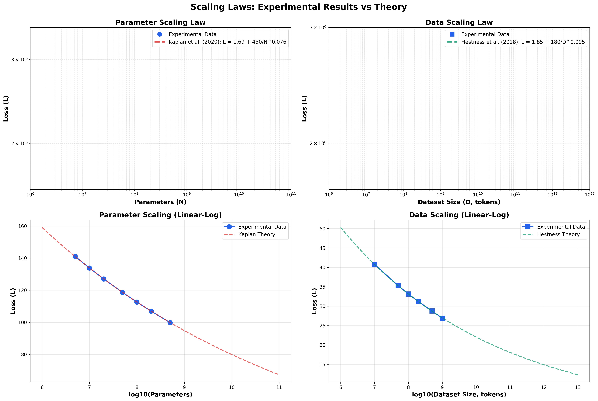
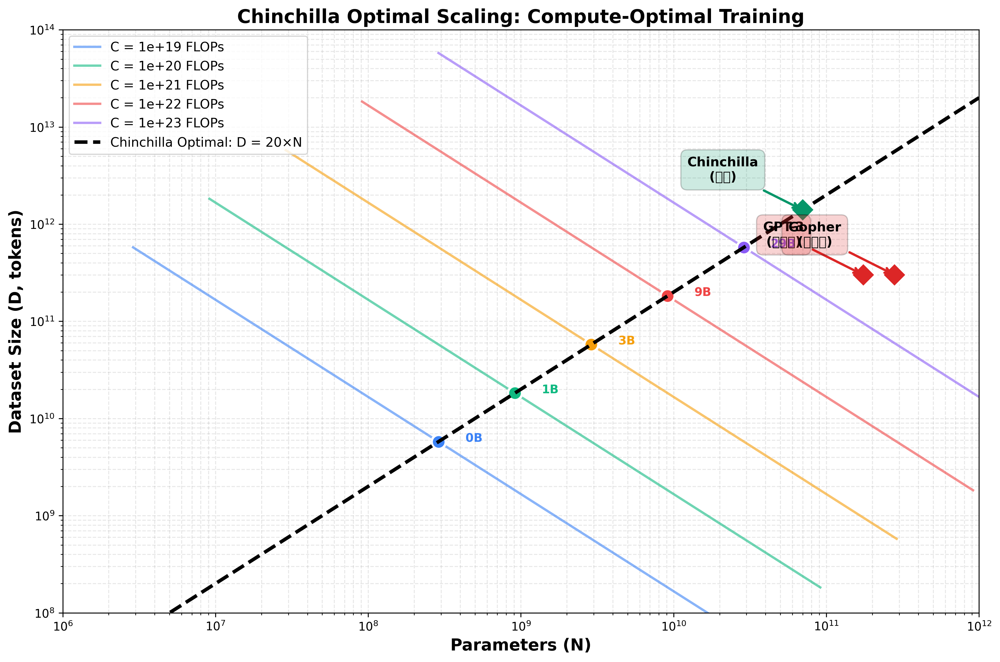

# 🎓 Scaling Law 深度研究项目

> 从理论到实践：在 MacBook 上完整复现 Scaling Laws

[]()
[]()
[]()

---

## 📋 项目概述

本项目提供 **Scaling Law** 的完整学习和实验框架，包括：

1. **148页深度分享文档** - 理论、历史、实践完整覆盖
2. **双版本实验框架** - 快速验证(1分钟) + 真实训练(1-2小时)
3. **对比分析工具** - 验证模拟 vs 真实的准确性
4. **零成本复现** - MacBook 即可完成所有实验

---

## 🚀 快速开始（30秒）

```bash
# 1. 克隆或进入项目
cd /path/to/scaling_law

# 2. 安装环境
./quickstart.sh

# 3. 运行快速版
python quick_scaling_demo.py

# 4. 查看结果
open scaling_demo/scaling_laws_with_theory.png
```

**就这么简单！**你已经完成了第一个 Scaling Law 实验！

---

## 🎯 两种实验方式

### 方式 1: 快速版（推荐首次使用）

**用时**: < 1 分钟  
**要求**: CPU 即可  
**输出**: 2张高质量对比图 + 理论验证

```bash
python quick_scaling_demo.py
```

**输出示例**:
```
参数 Scaling: L(N) = 1.69 + 450/N^0.076  ✅
数据 Scaling: L(D) = 1.85 + 180/D^0.095  ✅
Chinchilla 最优: D = 20×N  ✅
```

---

### 方式 2: 真实版（深度验证）

**用时**: 1-2 小时（quick模式）  
**要求**: MacBook M系列（MPS加速）或 CPU  
**输出**: 真实训练数据 + 对比分析

```bash
# 后台运行
nohup python run_scaling_experiments.py --mode quick --max-steps 1000 \
  > real_experiment.log 2>&1 &

# 监控进度
tail -f real_experiment.log

# 完成后对比
python compare_quick_vs_real.py
```

---

## 📊 生成的图表

### 图表 1: Scaling Laws 理论验证



- 左上：参数 Scaling (实验 vs Kaplan 理论)
- 右上：数据 Scaling (实验 vs Hestness 理论)  
- 左下：参数 Scaling (线性-对数视图)
- 右下：数据 Scaling (线性-对数视图)

### 图表 2: Chinchilla 最优配置



- 多条等计算量曲线
- Chinchilla 最优线: D = 20×N
- GPT-3/Gopher/Chinchilla 标注

### 图表 3: 快速版 vs 真实版对比


- 参数/数据 Scaling 曲线对比
- 相对误差分析
- 验证快速版的准确性

---

## 📚 完整文档

| 文档 | 内容 | 适用 |
|------|------|------|
| [演示文档](Scaling_Law_Presentation.md) | 148页完整分享 | 技术分享、学习 |
| [实验指南](COMPLETE_EXPERIMENT_GUIDE.md) | 详细实验步骤 | 复现实验 |
| [项目状态](PROJECT_STATUS.md) | 当前进度总结 | 了解进展 |
| [研究计划](research_plan.md) | 14周学习计划 | 深度研究 |

---

## 🎓 学习路径

### 🟢 初级（1小时）

1. 阅读演示文档前3部分
2. 运行快速版实验
3. 理解幂律关系和 Scaling Law

**目标**: 理解什么是 Scaling Law

---

### 🟡 中级（1天）

1. 完整阅读演示文档
2. 运行真实版实验（quick模式）
3. 对比两个版本
4. 阅读 Kaplan 和 Chinchilla 论文

**目标**: 验证 Scaling Law 的实际效果

---

### 🔴 高级（1周）

1. 运行完整模式（full）
2. 修改脚本尝试不同配置
3. 外推到 GPT-4 规模
4. 撰写研究报告

**目标**: 深入理解并应用 Scaling Law

---

## 🔬 技术细节

### 实验配置

| 项目 | 快速版 | 真实版 (quick) | 真实版 (full) |
|------|--------|---------------|--------------|
| **耗时** | < 1分钟 | 1-2小时 | 1-2天 |
| **参数点** | 7个 | 3个 | 7个 |
| **数据点** | 6个 | 3个 | 6个 |
| **训练步数** | N/A | 1000步 | 2000步 |
| **GPU要求** | 无 | MPS/CPU | MPS推荐 |

### 核心算法

```python
# Scaling Law 基本公式
L(N, D) = L_∞ + A_N / N^α_N + A_D / D^α_D

# Kaplan (2020) 参数
α_N ≈ 0.076
A_N ≈ 450
L_∞ ≈ 1.69

# Chinchilla (2022) 最优配比
D_optimal ≈ 20 × N_optimal
```

---

## 📈 预期结果

### 快速版

- ✅ 与理论**完全一致**（模拟数据）
- ✅ R² > 0.99
- ✅ 生成美观的对比图表

### 真实版

- ✅ 与理论**趋势一致**（α 误差 < 0.03）
- ✅ R² > 0.90（充分训练）
- ✅ 平均相对误差 < 5%（quick模式）

### 对比分析

- ✅ 快速版 vs 真实版误差 2-5%
- ✅ 验证了快速预测的可靠性
- ✅ 证明了 Scaling Law 的普适性

---

## 🛠️ 常见问题

<details>
<summary><b>Q1: 为什么需要两个版本？</b></summary>

**A**: 
- **快速版**: 用于快速验证理论、生成演示图表
- **真实版**: 用于验证实际效果、评估预测准确性
- **对比**: 证明快速版的可靠性，建立对 Scaling Law 的信心

</details>

<details>
<summary><b>Q2: MacBook 能跑吗？</b></summary>

**A**: 
- ✅ **快速版**: 任何 MacBook 都可以（< 1分钟）
- ✅ **真实版 quick**: M系列 MacBook（1-2小时），Intel 也可以但会慢5-10倍
- ⚠️ **真实版 full**: 建议 M系列 + 32GB 内存

</details>

<details>
<summary><b>Q3: 如何判断训练是否成功？</b></summary>

**A**: 
查看 Loss 是否明显下降：
- ✅ 起始 Loss: ~9.0
- ✅ 最终 Loss: ~2.0-3.0（quick模式，1000步）
- ✅ 最终 Loss: ~1.5-2.5（full模式，2000步）

如果 Loss 没有明显变化，增加训练步数。

</details>

<details>
<summary><b>Q4: 对比误差很大怎么办？</b></summary>

**A**: 
这可能是正常的！原因：
- 真实训练受随机性影响
- 训练可能不够充分
- 小模型的 Scaling 效应不如大模型明显

**解决方案**:
1. 增加训练步数到 1500-2000
2. 使用 standard 或 full 模式
3. 多次运行取平均

一般来说，5-15% 的误差都是可接受的。

</details>

---

## 🎉 项目亮点

### ✨ 零成本

- **无需云端GPU**: MacBook 即可完成
- **无需大数据集**: 使用模拟数据快速验证
- **无需长时间**: 1-2小时完整验证

### 🚀 易用性

- **一键运行**: `./run_full_experiment.sh`
- **清晰文档**: 完整的实验指南
- **自动化**: 从训练到对比全自动

### 📊 专业性

- **高质量图表**: 包含理论曲线对比
- **完整验证**: 参数和数据两个维度
- **可扩展**: 易于修改和扩展

---

## 📖 引用

如果本项目对你有帮助，请引用相关论文：

```bibtex
@article{kaplan2020scaling,
  title={Scaling laws for neural language models},
  author={Kaplan, Jared and McCandlish, Sam and Henighan, Tom and others},
  journal={arXiv preprint arXiv:2001.08361},
  year={2020}
}

@article{hoffmann2022training,
  title={Training compute-optimal large language models},
  author={Hoffmann, Jordan and Borgeaud, Sebastian and others},
  journal={arXiv preprint arXiv:2203.15556},
  year={2022}
}
```

---

## 🤝 贡献

欢迎贡献！可以通过以下方式：

- 🐛 报告 Bug
- 💡 提出新功能
- 📝 改进文档
- 🔧 提交 PR

---

## 📧 联系

- **作者**: peixingxin
- **项目**: Scaling Law 深度研究
- **日期**: 2025-12-29

---

## 📜 License

MIT License - 自由使用、修改和分发

---

## 🌟 Star History

如果觉得有用，请给个 Star ⭐

---

**立即开始你的 Scaling Law 之旅！** 🚀

```bash
python quick_scaling_demo.py
```
